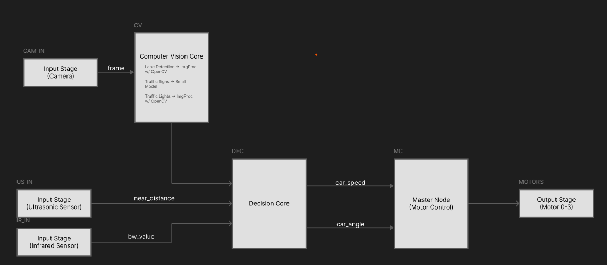

# AISE4020 - Academic Weapons 

## ECE Project Raspberry-Pi Car

We chose to do the ECE Pi-Car Project (2025-26) Below are the group members and roles

**Arnav** - Software & Autonomy

**Addy** - Controls & Motion

**Cristian** - Hardware & Embedded Systems

**Rafi** - Systems Integration

**Harjevan** - Testing, Validation & Safety

 
## Software Architecture

The main software for our car will be implemented via ROS2 (Jazzy). This repo will hold the stuff for the project.
*Note that for software stuff should be using an Ubuntu 24.04.03 VM for development*

ROS2 works a lot like a block diagram with several blocks (**Nodes**), and communications between them (**Topics**). Nodes that send a topic are called **Publishers**, and Nodes that recieve a topic are called **Subscribers**. These terms may be used to describe the arch in the given block diagram below

### Input Stages

The input stages act as a precursor to just get the sensor data into the ROS2 Network. Currently we have an input stage for each sensor

- Pi-Camera
- Ultrasonic Sensor
- Infrared Sensor

### Computer Vision Core

The computer vision core is the big block that deals with any "vision" related tasks. At the moment our spec lists these three things

- Traffic Light Detection
- Traffic Sign Detection
- Lane Keep Assist

These three things will be implemented as a mix of traditional image processing via openCV and a small YOLO model. Each of these will be their own nodes within  
this big one. Traffic Light and Lane Keep Assisst can be implemented via traditional image processing. Traffic sign detection will use a tiny YOLOv8 Model that hopefully wont turn the Pi into a hot-plate.

Sources for later:

- https://thinkrobotics.com/blogs/learn/yolov8-object-detection-on-raspberry-pi-a-complete-guide-for-real-time-ai-at-the-edge
- https://github.com/mgonzs13/yolo_ros
- https://medium.com/@galen.ballew/opencv-lanedetection-419361364fc0
- https://learnopencv.com/blob-detection-using-opencv-python-c/

### Decision Core

This is the main "logic" of the car, it will use data from both IR/US sensors, and the computer vision core in order to determine what the car should actually be doing. It outputs two control signals for the car's desired speed and angle to the Motor Control block.

