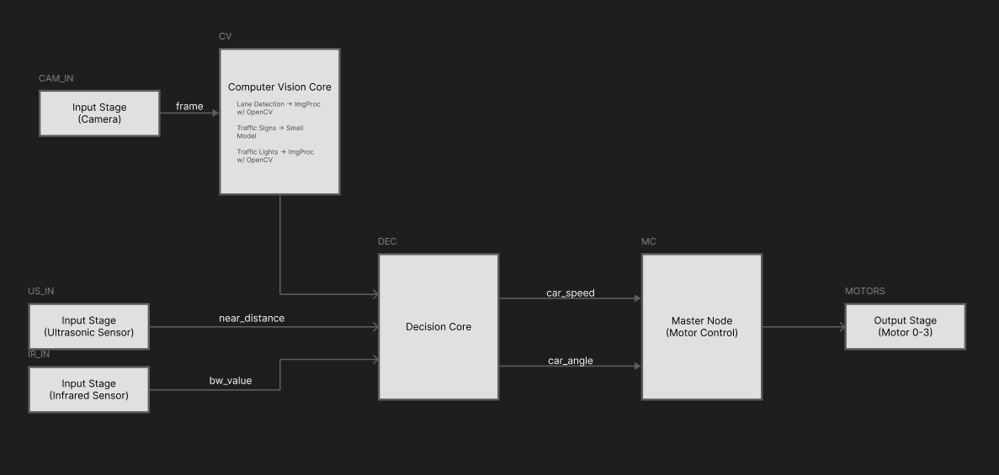

# Software & Autonomy (Sprint 1)

From the sprint 1 spec given by Rafi (`../systems/Sprint1_Log.md`). A few purely software functions are requested for scalable implementation.

1. Lane Following
2. Near Object Detection & Stopping
3. Speed Limit Sign Detection & Compliance
4. Traffic Light Detection
5. Stop Sign Detection

Given that this is a complex software stack, things should be implemented with ROS2 Jazzy, furthermore any software development will be done on an Ubuntu 24.04.03 VM, which is compatible with ROS2 Jazzy.

# Implementation Details

Implementation Details for each of the above will be discussed below. Note that eventually all of these inputs will be routed towards a singular output, which is the motor controls subsystem.

Redudancies will also be discussed wherever possible, however for systems purely dependent on one sensor type, redudancy is practically not possible unless we add another type of this sensor (which is probably not happening!). 

## Lane Following

**Sensors Used**: 3x Infrared (IR) Sensor, Camera

Our PiCar will come equipped with 3 IR sensors mounted near the bottom of the front chasis. They will all point downwards. We will also have a Camera available. Using these two sensors we can implement Lane Following with basic redudancy.

The IR sensors will allow a fast and reliable way to detect a lane (black tape on the ground) and ensure we follow it and the center IR sensor continues picking it up. 

Frames can also be extracted from the camera and can follow a simple image processing pipeline implemented in this post to extract a "steering angle" from the detected line. These two systems will work together such that the IR sensors have priority over the camera.

**Redundancy**

In the case the IR sensors fail, the camera can be used, and in the case both fail, we slow down to crawl and discard lane following as a whole, only obeying the other functions.

## Near Object Detection & Stopping

**Sensors Used**: Ultrasonic Sensor

Our PiCar should implement an ultrasonic sensor that allows us to measure distance directly from the front chasis of the car. Using this sensor we can easily set a threshold for when the car should stop if it detects an object close-by or not. This is a very basic feature and will not be discussed further.

## Speed Limit Sign Detection & Compliance

**Sensors Used**: Camera

We can reuse the camera provided frame, and run a simple QR Code or Shape detection algorithm that encodes a "speed limit" the car should obey. This can be done using an ArUco Marker, which is a simplified QR Code designed specifically for computer vision (CV) tasks. This can easily be done using `cv2.aruco`, which will avoid heavy OCR loops on our Pi and is a lightweight implementation.

Compliance is just a matter of parsing the aruco marker and setting an internal variable in the ROS2 Network, nothing crazy.

In the case where we fail to detect a speed limit sign for over some time $t > threshold$ we slow the car down to a crawl. This allows for a "safe redundancy"

## Traffic Light Detection

**Sensors Used**: Camera

For this we can do some traditional image processing, we can filter the current frame by red or green, and count the red/green pixels. If either of those have a count over some threshold we either stop or start the car. This should be pretty light compared to an overcomplicated DL approach.

## Stop Sign Detection

**Sensors Used**: Camera

For this we can use a traditional Yolov8 model which will output the bounding box, label, and confidence of the traffic sign. We can then use this to determine what to do with this information. Inference will not be run every frame, maybe every `n`'th frame will work, so our Pi doesnt explode.

# ROS2 Network Diagram

## Input Stages

The input stages act as a precursor to just get the sensor data into the ROS2 Network. Currently we have an input stage for each sensor

- Pi-Camera
- Ultrasonic Sensor
- 3x Infrared Sensor

## Computer Vision Core

The computer vision core is the big block that deals with any "vision" related tasks. At the moment our spec lists these three things that fall under CV

- Traffic Light Detection
- Traffic/Stop Sign Detection
- Lane Keep Assist

These three things will be implemented as a mix of traditional image processing via openCV and a small YOLO model. Each of these will be their own nodes within  
this big one. Traffic Light and Lane Keep Assisst can be implemented via traditional image processing. Traffic sign detection will use a tiny YOLOv8 Model that hopefully wont turn the Pi into a hot-plate.

Sources for later:

- https://thinkrobotics.com/blogs/learn/yolov8-object-detection-on-raspberry-pi-a-complete-guide-for-real-time-ai-at-the-edge
- https://github.com/mgonzs13/yolo_ros
- https://medium.com/@galen.ballew/opencv-lanedetection-419361364fc0
- https://learnopencv.com/blob-detection-using-opencv-python-c/

## Decision Core

This is the main "logic" of the car, it will use data from both IR/US sensors, and the computer vision core in order to determine what the car should actually be doing. It outputs two control signals for the car's desired speed and angle to the Motor Control block. This will need further discussion and is hard to architect until code is actually written.
